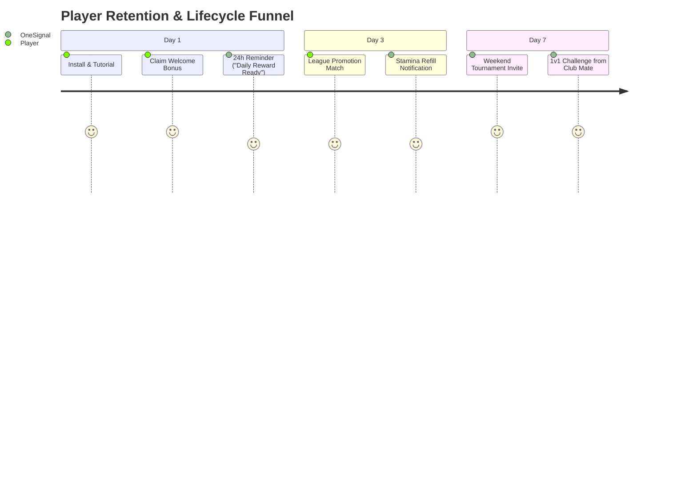

# Teqball Rally: Post-Release Growth, ASO & Marketing Playbook

This playbook provides actionable copy, configuration guides, and campaign strategies leveraging the **Shipaton 2026** partner toolkit (**OneSignal, Noise, Layers, Stripe, Sentry, AppScreens, AppFollow, AppTweak**).

---

## 1. App Store Optimization (ASO) Metadata Pack

### 1.1 Store Listing (Google Play & App Store)

- **App Title (30 characters)**:
  `Teqball Rally: 3D Table Soccer`
- **Short Description (80 characters)**:
  `Fast-paced 3D table soccer! Curve, volley, smash & play live 1v1 online matches.`
- **Category**: Sports / Arcade / Multiplayer

### 1.2 Full Description (Structured for Keywords & Conversion)

```markdown
Step up to the curved table and experience the thrill of real-time 3D Teqball! ⚽🔥

Teqball Rally delivers the ultimate table soccer experience on mobile with precision physics, realistic ball curves, and fast-paced 1v1 online rallies. Whether you want to play a quick casual match with intuitive one-handed portrait controls or master competitive spin shots in full landscape stick mode, Teqball Rally puts you in control.

⭐ KEY FEATURES ⭐

⚽ AUTHENTIC TEQBALL PHYSICS
Feel every touch! Control the ball with feet, knees, chest, and head. Curve your shots around the net, execute diving lunges, and unleash unstoppable smashes.

🎮 TWO WAYS TO PLAY
• Portrait Mode: Fluid one-touch and swipe controls for quick rallies on the go.
• Landscape Mode: Dual-thumb virtual joystick and kick power controls for tactical mastery.

🏆 CAREER & TOURNAMENTS
Climb the leagues from Local Courts to the World Cup Championship. Earn trophies, unlock elite players with unique agility and power attributes, and collect exclusive soccer balls.

🌐 REAL-TIME 1v1 MULTIPLAYER & CLUBS
Challenge friends or match with players worldwide in fast, low-latency online duels. Create or join Teqball Clubs, compete in weekly leaderboards, and climb the ranks together.

🏟️ DYNAMIC COURTS & CUSTOMIZATION
Play across 4 vibrant venues: The Street Cage, Sunny Park, Beach Arena, and the Pro Indoor Sports Hall. Customize your champion’s jersey, name, crest, and number.

No pay-to-win. Pure skill, timing, and football finesse. Download Teqball Rally today and become the next Teqball Champion!
```

### 1.3 High-Traffic Search Keywords
`teqball, table soccer, head football, volleyball soccer, footvolley, 3d soccer game, multiplayer football, penalty soccer, teq table, freestyle football, mini football, pocket soccer`

---

## 2. Store Screenshot Blueprint (AppScreens Guide)

Use **AppScreens** (Promo code `SHIPKIT50` for 50% off) with the following 5 slide templates:

| Slide # | Headline Banner | Visual Focus |
| --- | --- | --- |
| **Screen 1** | **"FEEL THE CURVE"** | Dynamic 3D smash animation showing ball trail and curved trajectory over the acrylic net. |
| **Screen 2** | **"REAL-TIME 1V1 ONLINE"** | Split action shot showing two players in an intense multiplayer rally with score banner. |
| **Screen 3** | **"PORTRAIT OR LANDSCAPE"** | Side-by-side mockup displaying seamless switching between 1-thumb portrait & 2-thumb stick controls. |
| **Screen 4** | **"CLIMB THE PRO LEAGUES"** | Trophy progression screen, tournament bracket, and customizable national kits. |
| **Screen 5** | **"4 ICONIC VENUES"** | Showcase The Cage, Beach, Sunny Park, and the Pro Indoor Arena. |

---

## 3. OneSignal Push Notification Strategy ($45k Prize Category)

Use the 3-month free Growth plan on OneSignal to trigger retention hooks:

### 3.1 Lifecycle Triggers



### 3.2 Automated Campaign Templates
1. **Daily Streak**:
   - Title: `🏆 Your Daily Bonus is Waiting!`
   - Body: `Jump into Teqball Rally today to keep your streak alive and claim free coins.`
2. **Stamina Refill**:
   - Title: `⚡ 100% Stamina Restored!`
   - Body: `Your player is fully rested. Step onto the court and win your next league match!`
3. **Multiplayer Challenge**:
   - Title: `⚽ Challengers Are Online!`
   - Body: `Opponents in your trophy tier are searching for a 1v1 match right now.`

---

## 4. Noise UGC Creator Campaign ($1,000 Matching Credit)

Targeting 10k-100k follower soccer / freestyle / mobile gaming creators on TikTok and Reels:

### 4.1 Creator Hook Brief: "The Hardest Mobile Soccer Game?"
- **Format**: Vertical 9:16 video (15–30 seconds) with creator facecam + gameplay overlay.
- **Hook (0-3s)**: *"Someone told me nobody can return this curve shot on Teqball Rally..."*
- **Action (3-15s)**: Creator tries to lunge and miss twice, then hits a bicycle kick finish on the 3rd attempt with high energy reaction.
- **Call To Action (15-20s)**: *"Search Teqball Rally on Google Play or hit the link in bio to 1v1 me!"*

---

## 5. Web-to-App Monetization Funnel (Stripe Projects $250 Credit)

- Host a web shop on your domain: `https://teqballrally.com/shop`.
- Offer web-exclusive bundles (e.g., *Pro Arena Lifetime + 500 Bonus Coins*) using Stripe Checkout.
- Provide users with an 8-character redemption code linked directly to their player ID (`claimOnServer(token, code)`).

---

## 6. Sentry Crash & ANR Reliability ($100 Credit)

To ensure **Crash-Free User Rate > 99.8%**:
- Capture unhandled errors and WebGL context restoration in `src/main.ts`.
- Tag events with `device_class`, `quality_tier`, and `orientation`.
